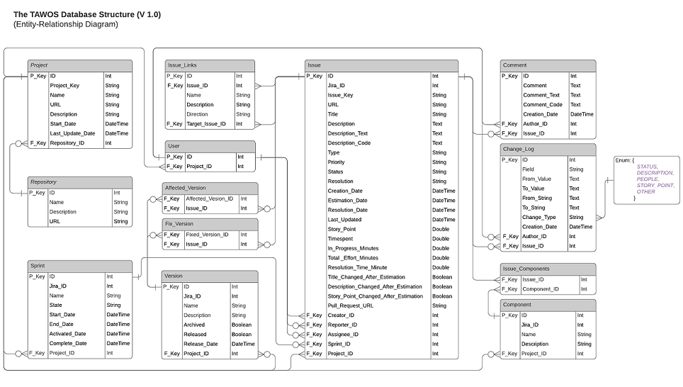
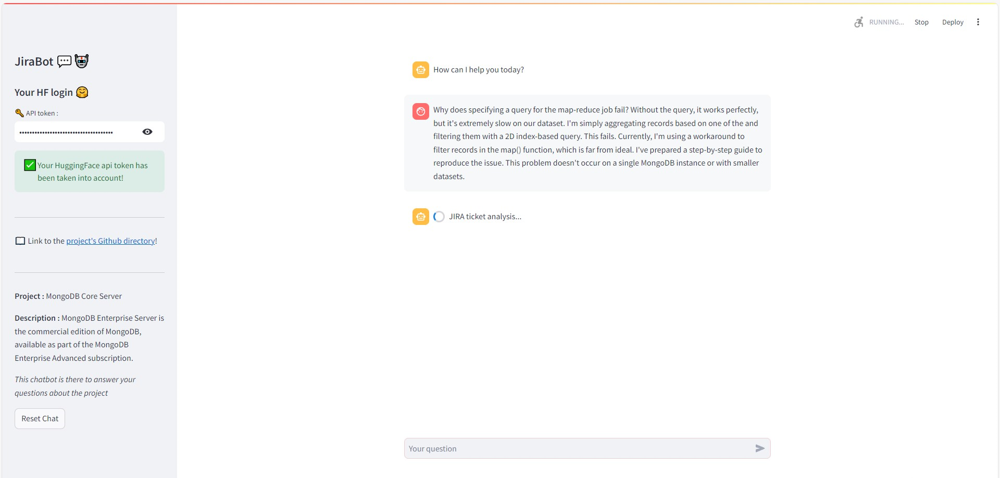
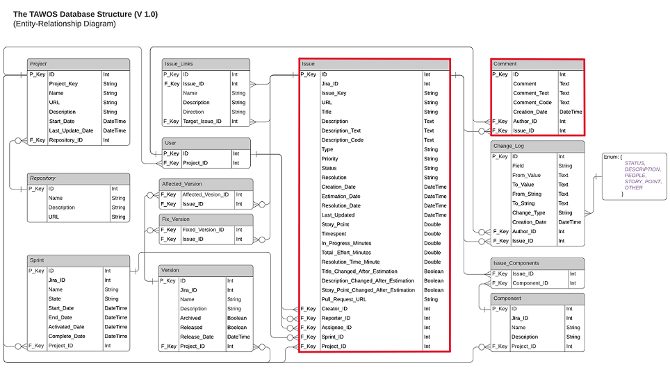
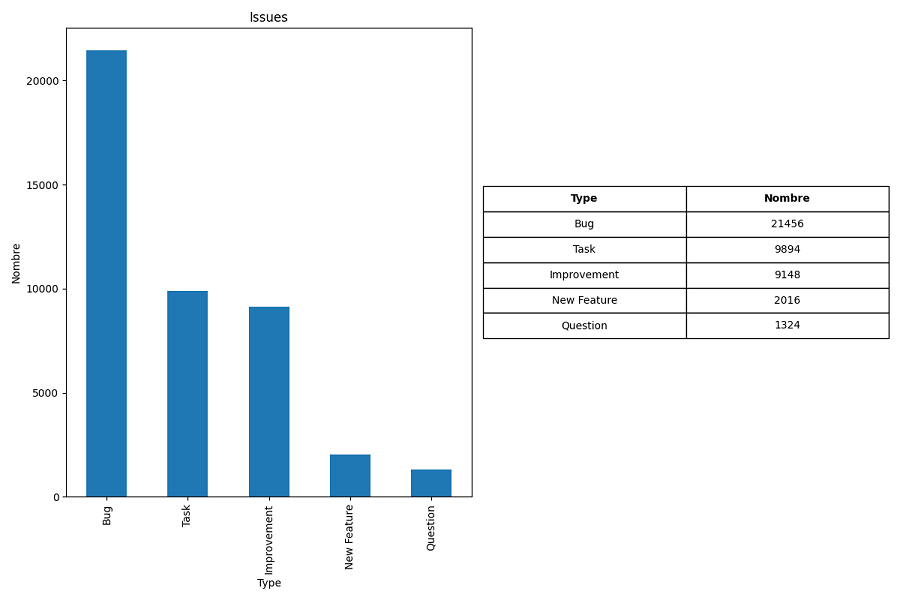
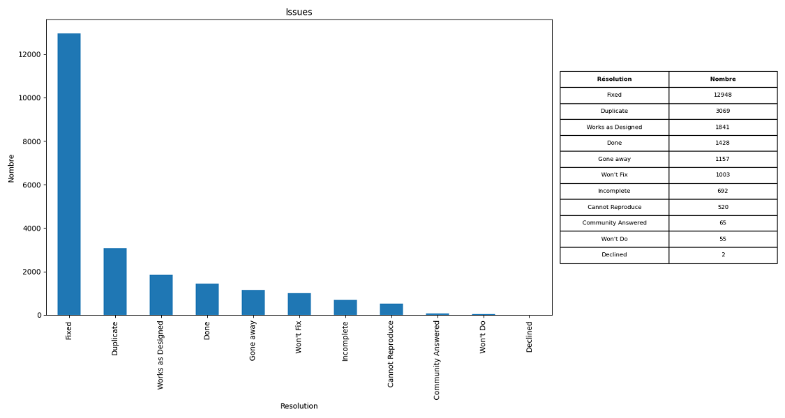
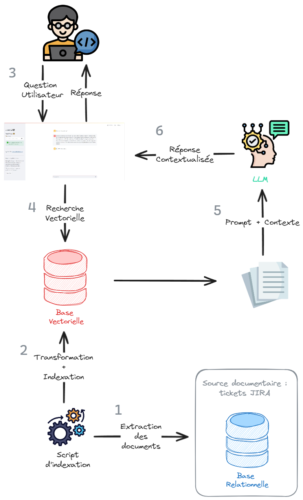
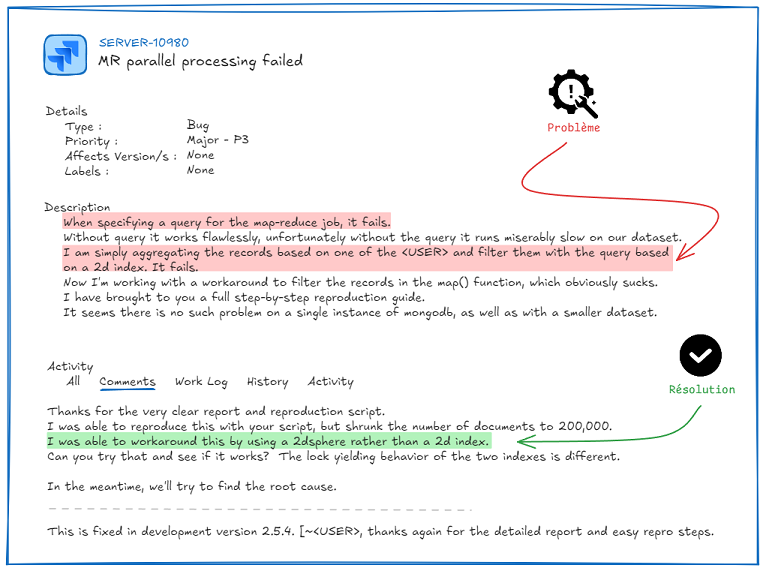
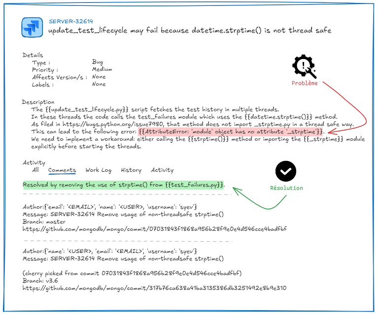

# RAG JIRA

> Mise en place d'un RAG pour l'analyse et la résolution de tickets JIRA.

- [RAG JIRA](#rag-jira)
  - [ℹ️ À propos](#ℹ️-à-propos)
    - [🧱 Structure du projet](#-structure-du-projet)
  - [🛠️ Exécution en local](#️-exécution-en-local)
    - [✅ Prérequis](#-prérequis)
    - [📦 Installation des dépendances](#-installation-des-dépendances)
  - [🚀 Méthodologie](#-méthodologie)
    - [Filtrage des tickets JIRA](#filtrage-des-tickets-jira)
      - [Type des issues](#type-des-issues)
      - [Status des issues](#status-des-issues)
      - [Resolution des issues](#resolution-des-issues)
      - [Dataset Final](#dataset-final)
    - [RAG](#rag)
    - [Questions pour la démo](#questions-pour-la-démo)
  - [📚 Liens utiles](#-liens-utiles)


## ℹ️ À propos

Ce projet propose une application chatbot avec RAG pour l'analyse et la résolution de tickets JIRA.

Ce projet est basé sur le jeu de données [TAWOS](https://rdr.ucl.ac.uk/articles/dataset/The_TAWOS_dataset/21308124) (**T**awosi **A**gile **W**eb-based **O**penSource) datant d'ocotbre 2020.
- Ce dataset regroupe des données provenant de 13 référentiels open source différents (Apache, Atlassian, MongoDB, Spring, ...).
- Tous ces référentiels utilisent JIRA comme plateforme de gestion des problèmes.
- 44 projets ont été selectionnés des ces référentiels.
- Le dataset contient au total 508 963 issues contribuées par 208 811 utilisateurs.

L'ensemble de données est hébergé plubliquement sur GitHub sous la forme d'une base de données relationnelle.



L'objectif de ce projet est de proposer un démonstrateur de RAG pour l'analyse et la résolution de tickets JIRA sur un projet spécifique.

Les issues JIRA vont servir de base de connaissance pour le LLM qui va pouvoir analyser et répondre à un problème utilisateur en s'aidant de la résolution d'ancien tickets JIRA.

### 🧱 Structure du projet

```bash
rag_jira
├─ doc/img
├─ src
│   ├─ entrepot                     # Package contenant tous les entrepots de données / modèles
│   │    ├─ __init__.py
│   │    ├─ embeddings.py
│   │    ├─ jira_issues.py
│   │    └─ redis_schema.yaml
│   ├─ service
│   │    ├─ __init__.py
│   │    └─ indexation.py           # Service d'indexation de la base Redis
│   │
│   ├─ __init__.py
│   └─ app.py                       # Application streamlit
│
├─ tests
│   └─ ..
├─ xp
│   ├─ analyse.ipynb                # Analyse des tickets jira
│   └─ script_de_test.py
.
.
.
├─ pyproject.toml                   # Dépendances du package rag_jira
└─ README.md
```

## 🛠️ Exécution en local

1. Déployer redis localement.
```console
docker run --name redis-jira -d -p 6379:6379 redis/redis-stack:latest
```

2. Installer [Redis Insight](https://redis.io/insight/) pour visualiser le contenu de la base. Et ajouter une nouvelle base de données Redis avec les informations suivantes :
   - **host**: 127.0.0.1
   - **port**: 6379

💡 Arrêter / Rédémarrer la base :
```console
docker stop redis-jira
docker start redis-jira
```

3. Installer les dépendances de l'application (voir [📦 Installation des dépendances](#-installation-des-dépendances)).

4. Avant de lancer le chatbot, faire une indexation des tickets jira.
```console
python src/service/indexation.py
```

💡 Pour vider la base, à l'aide du CLI de Redis Insight :
```
FLUSHDB
```

5. Lancer l'application streamlit.
```console
streamlit run src/app.py
```

L'application est disponible [ici](http://localhost:8501/).



### ✅ Prérequis

- **Langage :** Python
- **Base de données :** SQL, Redis
- **Outils :** DBeaver ou autre, Redis Insight
- **Framework :** Langchain
- **Modèles LLM :** Modèles disponibles sur [Hugging Face](https://huggingface.co/models)
- [**Dépendances**](./pyproject.toml)

### 📦 Installation des dépendances

- Créer un environnement virtuel.
  ```console
  cd rag_jira
  python -m venv venv
  ```

- Activer l'environnement virtuel avec `source venv/bin/activate` pour linux ou `.\venv\Scripts\activate` pour windows.

- Installer les dépendances du package `rag_jira`.
  ```console
  pip install -e .
  ```

## 🚀 Méthodologie

### Filtrage des tickets JIRA

Nous allons nous concentrer sur un projet spécifique pour faire notre application de résolution d'issues. Les issues et les commentaires associés nous servirons de base de connaissance pour notre application.



Informations sur le projet utilisé :
- Référentiel : MongoDB
- Projet : MongoDB Core Server
- Language de programmation : C++
- Nombre d'issues : 48 663
- Project Key : SERVER
- ID : 33
- Description : MongoDB Enterprise Server est l'édition commerciale de MongoDB, disponible dans le cadre de l'abonnement MongoDB Enterprise Advanced.


Pour savoir quels tickets jira vont être indexés dans notre base Redis, nous avons fait une [analyse du jeu de données TAWOS](./xp/analyse.ipynb). Les tickets jira qui serviront de base de connaissance pour notre RAG sont stockés dans un fichier csv, que vous pouvez dézipper dans le dossier `./rag_jira/xp/`.

#### Type des issues



Les types d'issues que nous conservons sont :
- Bug
- Question

#### Status des issues


Il n'y a que le status Closed pour les issues que nous conservons donc puisque cela signifie que les tickets ont été traités et résolus.

#### Resolution des issues



Les types de résolution que nous traîtons sont :
- Fixed
- Done
- Community Answered

#### Dataset Final

- *Nombre d'issues :* 14243
- *Nombe de features :* 8

<div>
<style scoped>
    .dataframe tbody tr th:only-of-type {
        vertical-align: middle;
    }

    .dataframe tbody tr th {
        vertical-align: top;
    }

    .dataframe thead th {
        text-align: right;
    }
</style>
<table border="1" class="dataframe">
  <thead>
    <tr style="text-align: right;">
      <th></th>
      <th>ID</th>
      <th>Title</th>
      <th>Description</th>
      <th>Type</th>
      <th>Status</th>
      <th>Resolution</th>
      <th>Last_Updated</th>
      <th>Comment</th>
    </tr>
  </thead>
  <tbody>
    <tr>
      <th>0</th>
      <td>460398</td>
      <td>"libunwind fails to build with GCC &gt;=10.2"</td>
      <td>"In the newer GCC version, C globals are now n...</td>
      <td>Bug</td>
      <td>Closed</td>
      <td>Fixed</td>
      <td>2020-10-21 02:03:04</td>
      <td>Author:{'name': '&lt;USER&gt;, 'email': '&lt;EMAIL&gt;', '...</td>
    </tr>
    <tr>
      <th>1</th>
      <td>460409</td>
      <td>"Fix 3-way compare for ArraySet in SBE"</td>
      <td></td>
      <td>Bug</td>
      <td>Closed</td>
      <td>Fixed</td>
      <td>2020-10-21 07:29:02</td>
      <td>Author:{'name': '&lt;USER&gt;, 'email': '&lt;EMAIL&gt;', '...</td>
    </tr>
    <tr>
      <th>2</th>
      <td>460418</td>
      <td>"'arrayEq()' undefined  in tenant_migration_no...</td>
      <td>"Load this  file ""jstests/aggregation/extras/...</td>
      <td>Bug</td>
      <td>Closed</td>
      <td>Fixed</td>
      <td>2020-10-20 18:41:40</td>
      <td>Author:{'name': 'XueruiFa', 'email': '&lt;EMAIL&gt;'...</td>
    </tr>
    <tr>
      <th>3</th>
      <td>460449</td>
      <td>"BSONElement::_binDataVector incorrect bindata...</td>
      <td>"I could be wrong, but I think {{BSONElement::...</td>
      <td>Bug</td>
      <td>Closed</td>
      <td>Fixed</td>
      <td>2020-10-20 02:06:58</td>
      <td>CR https://mongodbcr.appspot.com/693030002/, D...</td>
    </tr>
    <tr>
      <th>4</th>
      <td>460450</td>
      <td>"BSONElement::toString must account for negati...</td>
      <td>"SERVER-43909 changed {{toHex(char*,int)}} to ...</td>
      <td>Bug</td>
      <td>Closed</td>
      <td>Fixed</td>
      <td>2020-10-19 17:51:55</td>
      <td>\r\nCR https://mongodbcr.appspot.com/687240002...</td>
    </tr>
  </tbody>
</table>
</div>

### RAG



### Questions pour la démo
___

**Issue** :


**Question** : I have a map-reduce job that aggregates records and filters them with a query based on a 2d index that fails.
___

**Issue** :


**Question** : The update_test_lifecycle.py script returns the following error: AttributeError : the 'module' object has no '_strptime' attribute
___


## 📚 Liens utiles

- [TAWOS Dataset](https://rdr.ucl.ac.uk/articles/dataset/The_TAWOS_dataset/21308124)
- [Répertoire Github TAWOS](https://github.com/SOLAR-group/TAWOS)
- [A Versatile Dataset of Agile Open Source Software Projects](https://solar.cs.ucl.ac.uk/pdf/tawosi2022msr.pdf)
- [Langchain](https://python.langchain.com/v0.2/docs/introduction/)
- [Redis VectorStore](https://python.langchain.com/v0.2/docs/integrations/vectorstores/redis/)