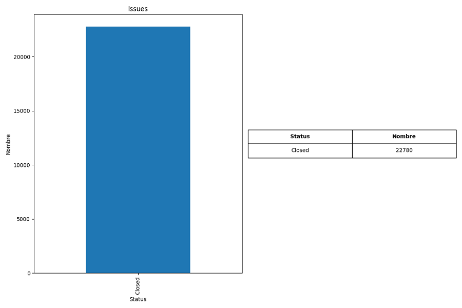
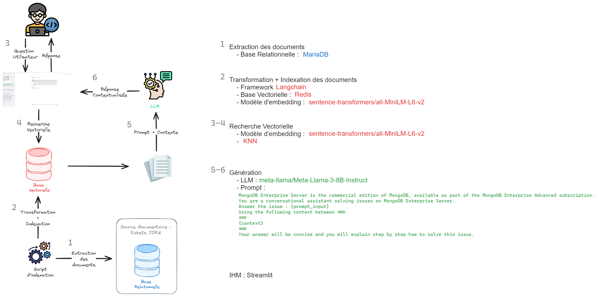

# RAG JIRA

> Mise en place d'un RAG pour l'analyse et la résolution de tickets JIRA.

- [RAG JIRA](#rag-jira)
  - [ℹ️ À propos](#ℹ️-à-propos)
    - [🧱 Structure du projet](#-structure-du-projet)
  - [🛠️ Exécution en local](#️-exécution-en-local)
    - [✅ Prérequis](#-prérequis)
    - [📦 Installation des dépendances](#-installation-des-dépendances)
  - [🚀 Méthodologie](#-méthodologie)
    - [Filtrage des tickets JIRA](#filtrage-des-tickets-jira)
      - [Type des issues](#type-des-issues)
      - [Status des issues](#status-des-issues)
      - [Resolution des issues](#resolution-des-issues)
    - [RAG](#rag)
    - [Questions pour la démo](#questions-pour-la-démo)
  - [📚 Liens utiles](#-liens-utiles)


## ℹ️ À propos

Ce projet propose une application chatbot avec RAG pour l'analyse et la résolution de tickets JIRA.

Ce projet est basé sur le jeu de données [TAWOS](https://rdr.ucl.ac.uk/articles/dataset/The_TAWOS_dataset/21308124) (**T**awosi **A**gile **W**eb-based **O**penSource) datant d'ocotbre 2020.
- Ce dataset regroupe des données provenant de 13 référentiels open source différents (Apache, Atlassian, MongoDB, Spring, ...).
- Tous ces référentiels utilisent JIRA comme plateforme de gestion des problèmes.
- 44 projets ont été selectionnés des ces référentiels.
- Le dataset contient au total 508 963 issues contribuées par 208 811 utilisateurs.

L'ensemble de données est hébergé plubliquement sur GitHub sous la forme d'une base de données relationnelle.


L'objectif de ce projet est de proposer un démonstrateur de RAG pour l'analyse et la résolution de tickets JIRA sur un projet spécifique.

Les issues JIRA vont servir de base de connaissance pour le LLM qui va pouvoir analyser et répondre à un problème utilisateur en s'aidant de la résolution d'ancien tickets JIRA.

### 🧱 Structure du projet

```bash
rag_jira
├─ doc/img
├─ src
│   ├─ entrepot                     # Package contenant tous les entrepots de données / modèles
│   │    ├─ __init__.py
│   │    ├─ embeddings.py
│   │    ├─ jira_issues.py
│   │    ├─ llm_models.py
│   │    └─ redis_schema.yaml
│   ├─ service
│   │    ├─ __init__.py
│   │    └─ indexation.py           # Service d'indexation de la base Redis
│   │
│   ├─ __init__.py
│   └─ app.py                       # Application streamlit
│
├─ tests
│   └─ ..
├─ xp
│   ├─ analyse.ipynb                # Analyse des tickets jira
│   └─ script_de_test.py
.
.
.
├─ pyproject.toml                   # Dépendances du package rag_jira
└─ README.md
```

## 🛠️ Exécution en local

1. Déployer redis localement.
```console
docker run --name redis-jira -d -p 6379:6379 redis/redis-stack:latest
```

2. Installer [Redis Insight](https://redis.io/insight/) pour visualiser le contenu de la base. Et ajouter une nouvelle base de données Redis avec les informations suivantes :
   - **host**: 127.0.0.1
   - **port**: 6379

💡 Arrêter / Rédémarrer la base :
```console
docker stop redis-jira
docker start redis-jira
```

3. Installer les dépendances de l'application (voir [📦 Installation des dépendances](#-installation-des-dépendances)).

4. Avant de lancer le chatbot, faire une indexation des tickets jira.
```console
python src/service/indexation.py
```

💡 Pour vider la base, à l'aide du CLI de Redis Insight :
```
FLUSHDB
```

5. Lancer l'application streamlit.
```console
streamlit run src/app.py
```

L'application est disponible [ici](http://localhost:8501/).


### ✅ Prérequis

- **Langage :** Python
- **Base de données :** SQL, Redis
- **Outils :** DBeaver ou autre, Redis Insight
- **Framework :** Langchain
- **Modèles LLM :** Modèles disponibles sur [Hugging Face](https://huggingface.co/models)
- [**Dépendances**](./pyproject.toml)

### 📦 Installation des dépendances

- Créer un environnement virtuel.
  ```console
  cd rag_jira
  python -m venv venv
  ```

- Activer l'environnement virtuel avec `source venv/bin/activate` pour linux ou `venv\Scripts\activate` pour windows.

- Installer les dépendances du package `rag_jira`.
  ```console
  pip install -e '.[dev]'
  ```

## 🚀 Méthodologie

### Filtrage des tickets JIRA

Nous allons nous concentrer sur un projet spécifique pour faire notre application de résolution d'issues. Les issues et les commentaires associés nous servirons de base de connaissance pour notre application.


Informations sur le projet utilisé :
- Référentiel : MongoDB
- Projet : MongoDB Core Server
- Language de programmation : C++
- Nombre d'issues : 48 663
- Project Key : SERVER
- ID : 33
- Description : MongoDB Enterprise Server est l'édition commerciale de MongoDB, disponible dans le cadre de l'abonnement MongoDB Enterprise Advanced.


Pour savoir quels tickets jira vont être indexés dans notre base Redis, nous avons fait une [analyse du jeu de données TAWOS](./xp/analyse.ipynb). Les tickets jira qui serviront de base de connaissance pour notre RAG sont stockés dans un fichier csv.

#### Type des issues


Les types d'issues que nous conservons sont :
- Bug
- Question

#### Status des issues



Il n'y a que le status Closed pour les issues que nous conservons donc puisque cela signifie que les tickets ont été traités et résolus.

#### Resolution des issues


Les types de résolution que nous traîtons sont :
- Fixed
- Done
- Community Answered

### RAG



### Questions pour la démo
___

**Original message :** When specifying a query for the map-reduce job, it fails. Without query it works flawlessly, unfortunately without the query it runs miserably slow on our dataset.  I am simply aggregating the records based on one of the <USER> and filter them with the query based on a 2d index. It fails. Now I'm working with a workaround to filter the records in the map() function, which obviously sucks.  I have brought to you a full step-by-step reproduction guide. It seems there is no such problem on a single instance of mongodb, as well as with a smaller dataset.

**Reformulation :** Why does specifying a query for the map-reduce job fail? Without the query, it works perfectly, but it's extremely slow on our dataset. I'm simply aggregating records based on one of the and filtering them with a 2D index-based query. This fails. Currently, I'm using a workaround to filter records in the map() function, which is far from ideal. I've prepared a step-by-step guide to reproduce the issue. This problem doesn't occur on a single MongoDB instance or with smaller datasets.

**La réponse doit contenir :** I was able to workaround this by using a 2dsphere rather than a 2d index.
___

**Original message :** The {{update_test_lifecycle.py}} script fetches the test history in multiple threads.  In these threads the code calls the test_failures module which uses the {{datetime.strptime()}} method.  As filed in https://bugs.python.org/issue7980, that method does not import _strptime.py in a thread safe way.  This can lead to the following error: {{AttributeError: 'module' object has no attribute '_strptime'}}.    We need to implement a workaround: either calling the {{strptime()}} method or importing the {{_strptime}} module explicitly before starting the threads.

**Reformulation :** How can we work around the thread safety issue related to using the {{datetime.strptime()}} method in the {{update_test_lifecycle.py}} script, given that this script fetches test history using multiple threads and this can lead to an {{AttributeError: 'module' object has no attribute '_strptime'}} as mentioned in https://bugs.python.org/issue7980? Should we explicitly call the {{strptime()}} method or import the {{_strptime}} module before starting the threads to avoid this error?

**La réponse doit contenir :** Resolved by removing the use of strptime() from {{test_failures.py}}
___

I've created a collection with 100k entries like:  {code} { a: <int>, b: <int>, c: <int>, txt: <5k string> } {code}  And query with:  {code} > db.foo.find({a: {$lt: 32065}, b: 23}) {code}  Explain shows this:  {code} {  ""cursor"" : ""BasicCursor"",  ""nscanned"" : 100000,  ""nscannedObjects"" : 100000,  ""n"" : 211,  ""millis"" : 140,  ""nYields"" : 0,  ""nChunkSkips"" : 0,  ""isMultiKey"" : false,  ""indexOnly"" : false,  ""indexBounds"" : {     } } {code}  But system.profile shows this:  {code} {  ""ts"" : ISODate(""2011-09-20T17:25:19.664Z""),  ""op"" : ""query"",  ""ns"" : ""test.foo"",  ""query"" : {   ""query"" : {    ""a"" : {     ""$lt"" : 32065    },    ""b"" : 23   },   ""$explain"" : true  },  ""nscanned"" : 100000,  ""nreturned"" : 1,  ""responseLength"" : 297,  ""millis"" : 0,  ""client"" : ""127.0.0.1"",  ""user"" : """" } {code}  With profiling level set to 1, the output in system.profile reflects the correct millis. The profile output in 1.8.3 is correct:  {code} {         ""ts"" : ISODate(""2011-09-20T17:24:37.464Z""),         ""info"" : ""query example.bigdocs reslen:313 nscanned:100000  \\nquery: { query: { a: { $lt: 32065.0 }, b: 23.0 }, $explain: true }  nreturned:1 bytes:297"",         ""millis"" : 56 } {code}  (Note that this behavior is true with or without .explain(), I only used that to find out the actual millis to execute the query)

**Reformulation :** How can I create a collection with 100,000 entries of the type { a: <int>, b: <int>, c: <int>, txt: <5k string> }, and query this collection with db.foo.find({a: {$lt: 32065}, b: 23}) while obtaining consistent results between the query explanation (explain) and the system profiling (system.profile), given that the profiling level is set to 1?

**La réponse doit contenir :** {code}
db.setProfilingLevel(2)
{code}

use:

{code}
db.runCommand({profile: 1, slowms: 0})
{code}

___

## 📚 Liens utiles

- [TAWOS Dataset](https://rdr.ucl.ac.uk/articles/dataset/The_TAWOS_dataset/21308124)
- [Répertoire Github TAWOS](https://github.com/SOLAR-group/TAWOS)
- [A Versatile Dataset of Agile Open Source Software Projects](https://solar.cs.ucl.ac.uk/pdf/tawosi2022msr.pdf)
- [Langchain](https://python.langchain.com/v0.2/docs/introduction/)
- [Redis VectorStore](https://python.langchain.com/v0.2/docs/integrations/vectorstores/redis/)